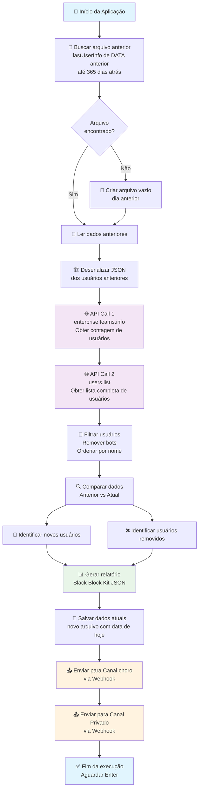

# 🤖 Bot Fofoqueiro

> **Sistema de monitoramento de usuários do Slack** que detecta automaticamente novos membros e saídas da equipe, enviando relatórios formatados via webhooks.

[](https://dotnet.microsoft.com/)
[](https://docs.microsoft.com/en-us/dotnet/csharp/)
[](https://api.slack.com/)

## 📋 Visão Geral

O **Bot Fofoqueiro** é uma aplicação Console em .NET que monitora mudanças na lista de membros de um workspace do Slack. Ele compara dados históricos com informações atuais para identificar:

- ✅ **Novos usuários** que entraram na equipe
- ❌ **Usuários removidos** que saíram da equipe  
- 📊 **Estatísticas** de membros ativos
- ⏱️ **Tempo de permanência** dos usuários removidos

## 🏗️ Arquitetura e Fluxo



## 🚀 Funcionalidades

### 🔍 **Monitoramento Inteligente**
- Busca automaticamente dados históricos (até 365 dias atrás)
- Compara estado atual com último snapshot salvo
- Sistema de retry para chamadas à API do Slack

### 📊 **Detecção de Mudanças**
- **Novos usuários**: Identifica membros que não existiam no último snapshot
- **Usuários removidos**: Detecta membros que foram marcados como `deleted`
- **Estatísticas duplas**: Conta usuários via API enterprise e lista de usuários

### 📨 **Relatórios Formatados**
- Mensagens em **Slack Block Kit** com formatação rica
- Menciona usuários usando `<@user_id>`
- Calcula tempo de permanência para usuários removidos
- Envia para múltiplos canais simultáneamente

### 💾 **Persistência de Dados**
- Salva snapshots diários em arquivos JSON
- Localização configurável (padrão: Desktop/SlackUserList)
- Nomeação por data: `lastUserInfo_dd_MM_yyyy.txt`

### ⚡ **Performance e Monitoramento**
- Cronômetro integrado para medir tempo de cada operação
- Sistema de retry com backoff para APIs instáveis
- Logs detalhados de todas as etapas

## 🛠️ Configuração

### 1. **Configurar Credenciais (User Secrets)**

```bash
# Configurar tokens e webhooks de forma segura
dotnet user-secrets set "SlackBotConfiguration:SlackToken" "SEU_TOKEN_AQUI"
dotnet user-secrets set "SlackBotConfiguration:SlackCookie" "SEU_COOKIE_AQUI"
dotnet user-secrets set "SlackBotConfiguration:Webhooks:ChoroChannel" "https://hooks.slack.com/services/SEU/WEBHOOK/CHORO"
dotnet user-secrets set "SlackBotConfiguration:Webhooks:PrivateChannel" "https://hooks.slack.com/services/SEU/WEBHOOK/PRIVADO"
```

### 2. **Verificar Configuração**

```bash
dotnet user-secrets list
```

## 🏃‍♂️ Como Executar

```bash
# Clonar o repositório
git clone <repositorio>
cd bot_fofoqueiro

# Restaurar dependências
dotnet restore

# Executar em modo desenvolvimento
dotnet run

# Compilar release
dotnet publish bot_fofoqueiro.csproj -c Release -o versao_estavel -p:PublishSingleFile=true --self-contained true
```

## 📁 Estrutura do Projeto

```
bot_fofoqueiro/
├── Program.cs                      # Lógica principal da aplicação
├── SlackBotConfiguration.cs        # Modelo de configuração
├── SlackUserInfoResponse.cs        # DTOs da API users.list
├── SlackTeamInfoResponse.cs        # DTOs da API enterprise.teams.info
├── appsettings.json               # Configuração base
├── appsettings.template.json      # Template para configuração
├── SECURITY_CONFIG.md             # Guia de configuração segura
└── versao_estavel/                # Build de produção
```

## 🔧 Dependências

```xml
<PackageReference Include="Newtonsoft.Json" Version="13.0.3" />
<PackageReference Include="Microsoft.Extensions.Configuration" Version="8.0.0" />
<PackageReference Include="Microsoft.Extensions.Configuration.Json" Version="8.0.0" />
<PackageReference Include="Microsoft.Extensions.Configuration.UserSecrets" Version="8.0.0" />
<PackageReference Include="Microsoft.Extensions.Configuration.Binder" Version="8.0.0" />
```

## 📤 Exemplo de Saída

### **Mensagem no Slack:**

```
⚠️ BOT FOFOQUEIRO ⚠️

TOTAL DE USUÁRIOS ATIVOS [V1] - 125 MEMBROS
TOTAL DE USUÁRIOS ATIVOS [V2] - 123 MEMBROS

NOVOS USUÁRIOS - [2]
@U123ABC João Silva
@U456DEF Maria Santos

USUÁRIOS REMOVIDOS - [1]  
@U789GHI Pedro Costa (87 dias)
```

### **Logs da Console:**

```
🤖 BOT FOFOQUEIRO INICIADO
📋 Carregando configurações...
⏱️ Carregamento de configurações: 0.12s
📁 Gerenciando arquivos de histórico...
📖 Arquivo anterior encontrado: lastUserInfo_26_02_2026.txt
⏱️ Busca do último arquivo: 0.02s
📚 Carregando dados de usuários anteriores...
📊 Total de registros anteriores: 120
⏱️ Carregamento de dados anteriores: 0.08s
🌐 Buscando dados atuais do Slack...
✅ Enterprise Teams Info API: Sucesso na tentativa 1
✅ Users List API: Sucesso na tentativa 1
⏱️ Busca de dados atuais do Slack: 1.24s
🤖 Processando usuários atuais...
👥 Usuários processados: 122 (bots removidos)
🔍 Comparando dados de usuários...
📊 Usuários ativos: 121
🆕 Novos usuários: 2
❌ Usuários removidos: 1
💾 Salvando dados atuais...
📤 Enviando notificações para o Slack...
✅ Mensagem enviada para Canal CHORO
✅ Mensagem enviada para Canal PRIVADO
✅ BOT FOFOQUEIRO FINALIZADO COM SUCESSO
```

## 🔐 Segurança

- **User Secrets**: Credenciais armazenadas fora do código fonte
- **Gitignore**: Exclusão automática de arquivos sensíveis  
- **Configuração separada**: Template público, dados privados seguros
- **Zero hardcoding**: Nenhum token ou webhook no código

## 🗂️ APIs Utilizadas

| API | Propósito | Autenticação |
|-----|-----------|--------------|
| `enterprise.teams.info` | Contagem oficial de membros | OAuth Token + Cookie |
| `users.list` | Lista detalhada de usuários | OAuth Token + Cookie |

## 📝 Observações

- Execução diária recomendada via agendador de tarefas
- Requer permissões de leitura no workspace do Slack  
- Armazena histórico local para comparações
- Sistema resiliente com retry automático para APIs instáveis

## 📋 Changelog

Consulte o [CHANGELOG.md](CHANGELOG.md) para o histórico completo de alterações.

---

**Desenvolvido com ❤️ para monitoramento automatizado de equipes Slack**